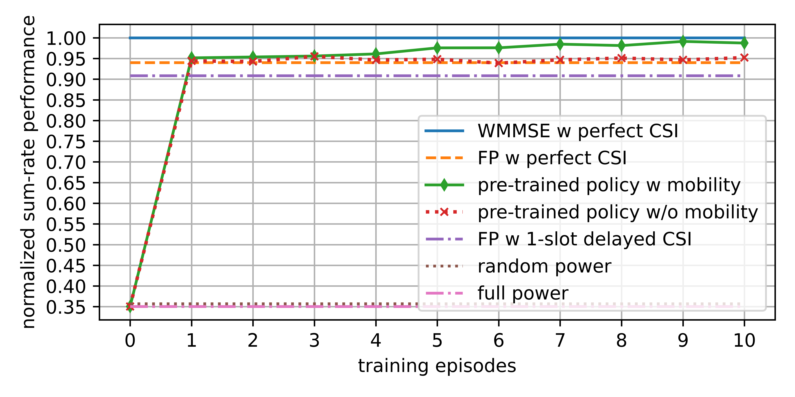
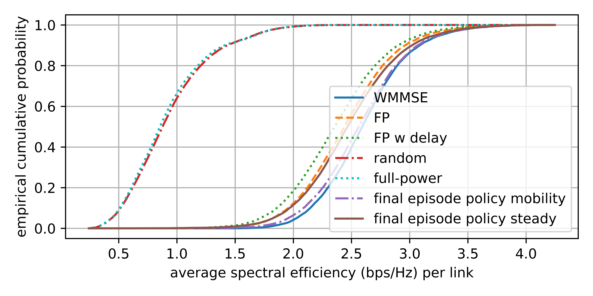
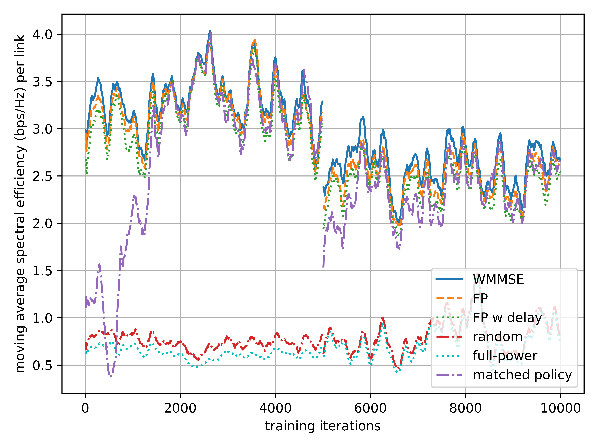

# Deep Actor-Critic Learning for Distributed Power Control in Wireless Mobile Networks
## Asilomar 2020 Code
### Authors: Yasar Sinan Nasir and Dongning Guo
#### Please email me for any questions or comments: snasir [at] u.northwestern [dot] edu
> **Note:** Instructions are for Linux. 
> Please create a virtual environment and install the specified tensorflow and numpy versions:
> > `python3.6 -m pip install --user virtualenv`
> > `virtualenv -p python3.6 venv`
> > `source $HOME/venv/bin/activate`
> > `pip install -r requirements.txt`
#### Reproducing Fig. 4:
The repository comes with the data to reproduce Fig.4, simply run:
> * `python3 -i ./fig4.py --json-file "test_K10_N20_shadow10_episode5-2500_travel0_vmax2_5" --json-file-wmobility "train_K10_N20_shadow10_episode10-5000_travel50000_vmax2_5" --json-file-womobility "train_K10_N20_shadow10_episode10-5000_travel0_fd10" --json-file-policy-train "ddpg200_100_50"`
* **Expected Output:** 
 >Test: test_K10_N20_shadow10_episode5-2500_travel0_vmax2_5; train train_K10_N20_shadow10_episode10-5000_travel50000_vmax2_5; policy: ddpg200_100_50
Sum rate policy after 0 episodes: 0.91, percentage: 0.35
Sum rate policy after 1 episodes: 2.48, percentage: 0.95
Sum rate policy after 2 episodes: 2.49, percentage: 0.95
Sum rate policy after 3 episodes: 2.49, percentage: 0.96
Sum rate policy after 4 episodes: 2.51, percentage: 0.96
Sum rate policy after 5 episodes: 2.54, percentage: 0.98
Sum rate policy after 6 episodes: 2.55, percentage: 0.98
Sum rate policy after 7 episodes: 2.57, percentage: 0.98
Sum rate policy after 8 episodes: 2.56, percentage: 0.98
Sum rate policy after 9 episodes: 2.59, percentage: 0.99
Sum rate policy after 10 episodes: 2.58, percentage: 0.99
Test: test_K10_N20_shadow10_episode5-2500_travel0_vmax2_5; train train_K10_N20_shadow10_episode10-5000_travel0_fd10; policy: ddpg200_100_50
Sum rate policy after 0 episodes: 0.91, percentage: 0.35
Sum rate policy after 1 episodes: 2.46, percentage: 0.94
Sum rate policy after 2 episodes: 2.46, percentage: 0.94
Sum rate policy after 3 episodes: 2.49, percentage: 0.96
Sum rate policy after 4 episodes: 2.47, percentage: 0.95
Sum rate policy after 5 episodes: 2.47, percentage: 0.95
Sum rate policy after 6 episodes: 2.45, percentage: 0.94
Sum rate policy after 7 episodes: 2.47, percentage: 0.95
Sum rate policy after 8 episodes: 2.48, percentage: 0.95
Sum rate policy after 9 episodes: 2.47, percentage: 0.95
Sum rate policy after 10 episodes: 2.48, percentage: 0.95
Sum rate per link - WMMSE: 2.61, percentage: 1.00
Sum rate per link - FP: 2.45, percentage: 0.94
Sum rate per link - FP w delay: 2.37, percentage: 0.91
Sum rate per link - random: 0.93, percentage: 0.36
Sum rate per link - max: 0.91, percentage: 0.35
Average time for a WMMSE run: 11.74 ms
Average time for an FP run: 6.09 ms
Average time for a DDPGnomobility agent to determine its action 0.47 ms
Average WMMSE iterations per run: 42.12
Average FP iterations per run: 24.36

#### Reproducing Table I:
The repository contains the pre-trained policy parameters in ./simulations/sumrate/policy, so there is no need to run training to reproduce the results. For each row of Table I, you can execute:
* > ./scripts/test20links.sh
* > ./scripts/test40links.sh
 **Expected Output:**
Test: test_K20_N40_shadow10_episode5-2500_travel0_vmax2_5; train train_K10_N20_shadow10_episode10-5000_travel50000_vmax2_5; policy: ddpg200_100_50
Sum rate per link for policy after 10 episodes: 1.97, percentage: 0.94
Sum rate per link - WMMSE: 2.09, percentage: 1.00
Sum rate per link - FP: 1.98, percentage: 0.94
Sum rate per link - FP w delay: 1.87, percentage: 0.90
Sum rate per link - random: 0.62, percentage: 0.30
Sum rate per link - full: 0.60, percentage: 0.29
Average time for a WMMSE run: 54.67 ms
Average time for an FP run: 14.24 ms
Average time for a policy agent to determine its action 0.46 ms
Average WMMSE iterations per run: 71.53
Average FP iterations per run: 28.92
 
* > ./scripts/test60links.sh
 **Expected Output:**
Test: test_K20_N60_shadow10_episode5-2500_travel0_vmax2_5; train train_K10_N20_shadow10_episode10-5000_travel50000_vmax2_5; policy: ddpg200_100_50
Sum rate per link for policy after 10 episodes: 1.58, percentage: 0.94
Sum rate per link - WMMSE: 1.68, percentage: 1.00
Sum rate per link - FP: 1.59, percentage: 0.94
Sum rate per link - FP w delay: 1.50, percentage: 0.89
Sum rate per link - random: 0.37, percentage: 0.22
Sum rate per link - full: 0.35, percentage: 0.21
Average time for a WMMSE run: 94.88 ms
Average time for an FP run: 23.05 ms
Average time for a policy agent to determine its action 0.45 ms
Average WMMSE iterations per run: 80.06
Average FP iterations per run: 28.22
 
* > ./scripts/test100links.sh
 **Expected Output:**
Test: test_K20_N100_shadow10_episode5-2500_travel0_vmax2_5; train train_K10_N20_shadow10_episode10-5000_travel50000_vmax2_5; policy: ddpg200_100_50
Sum rate per link for policy after 10 episodes: 1.14, percentage: 0.93
Sum rate per link - WMMSE: 1.23, percentage: 1.00
Sum rate per link - FP: 1.15, percentage: 0.93
Sum rate per link - FP w delay: 1.09, percentage: 0.88
Sum rate per link - random: 0.18, percentage: 0.15
Sum rate per link - full: 0.17, percentage: 0.14
Average time for a WMMSE run: 187.76 ms
Average time for an FP run: 36.34 ms
Average time for a policy agent to determine its action 0.35 ms
Average WMMSE iterations per run: 86.11
Average FP iterations per run: 25.71
 
#### To train a policy from scratch:
We prepared a bash script file that runs all the python files required to run all simulations from scratch:
> ./scripts/train.sh
#### Demo:
It takes several hours to complete the above script, so you can try a much simpler simulation setup that just runs 2 training episodes for a 10 link scenario to get a sense of how our simulator works:
> ./scripts/demo.sh
* **Expected Output:** 
Deployment: train_K5_N10_shadow10_episode2-5000_travel50000_vmax2_5; policy: ddpg200_100_50; K: 10; N: 5
Averages for last 200 episodes:
Sum rate per link - policy: 2.58
Sum rate per link - WMMSE: 2.69
Sum rate per link - FP: 2.62
Sum rate per link - FP w delay: 2.51
Sum rate per link - random: 0.91
Sum rate per link - full: 0.85
Average time for a WMMSE run: 4.13 ms
Average time for an FP run: 6.16 ms
Average time for a policy agent to determine its action 0.53 ms
Average time for a policy mini-batch train 25.20 ms
Average WMMSE iterations per run: 29.23
Average FP iterations per run: 43.95

#### Configuration files:
1. DDPG hyper-parameters are in ./config/policy/ddpg200_100_50.json:
	{
	    "N_neighbors": 5,
	    "scale_R_inner": 0.75,
	    "scale_R_interf": 2.5,
	    "n_hiddens": [
	        200,
	        100,
	        50
	    ],
	    "neightresh": 2,
	    "discount_factor": 0.25,
	    "learning_rate_0_critic": 0.001,
	    "learning_rate_decay_critic": 0.9995,
	    "learning_rate_min_critic": 0.0000,
	    "learning_rate_0_actor": 0.0005,
	    "learning_rate_decay_actor": 0.9995,
	    "learning_rate_min_actor": 0.0000,
	    "target_update_count": 50,
	    "time_slot_to_pass_weights": 50,
	    "max_epsilon": 0.05,
	    "epsilon_decay": 0.9995,
	    "min_epsilon": 0.00,
	    "batch_size": 128,
	    "memory_per_agent": 1000,
	    "cuda":false
	}
	> **Note:** If you set cuda to True, running python files in parallel as done in the scripts will not work.
	> **Note:** Scaling parameters are used to scale the channel gains in dB before feeding them into neural networks.
2. Deployment scenarios are in ./config/deployment/. There are two types of configuration files: train and test. Please examine both before using.

